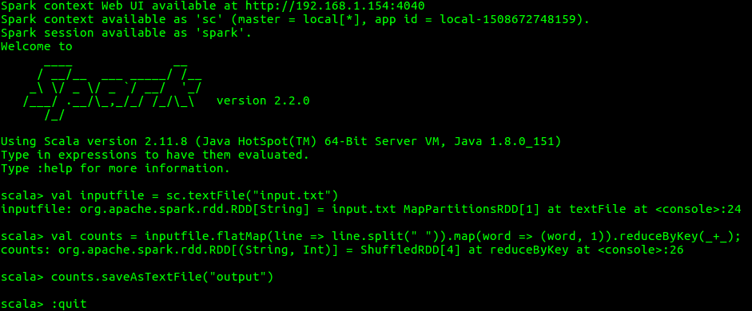
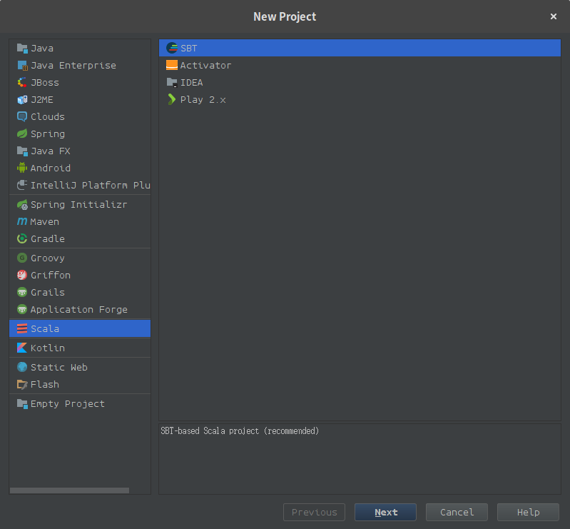
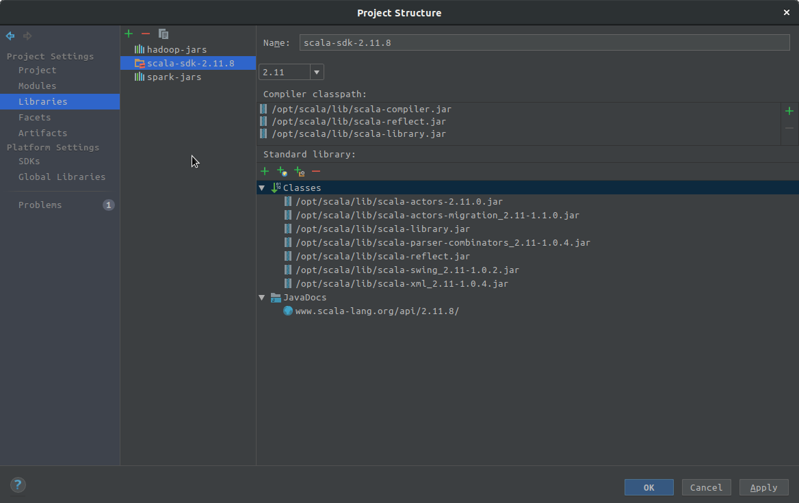
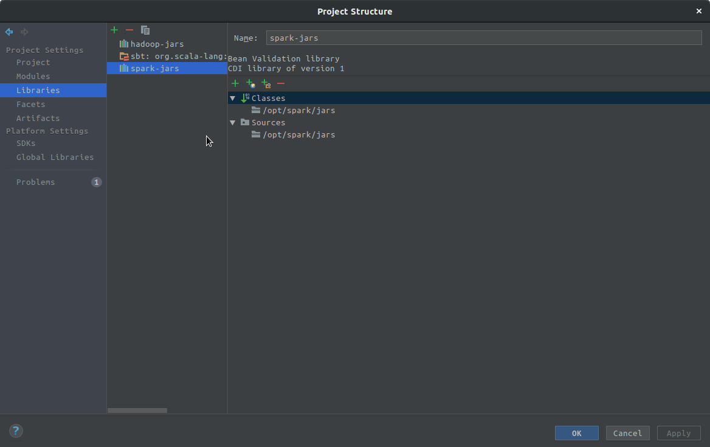
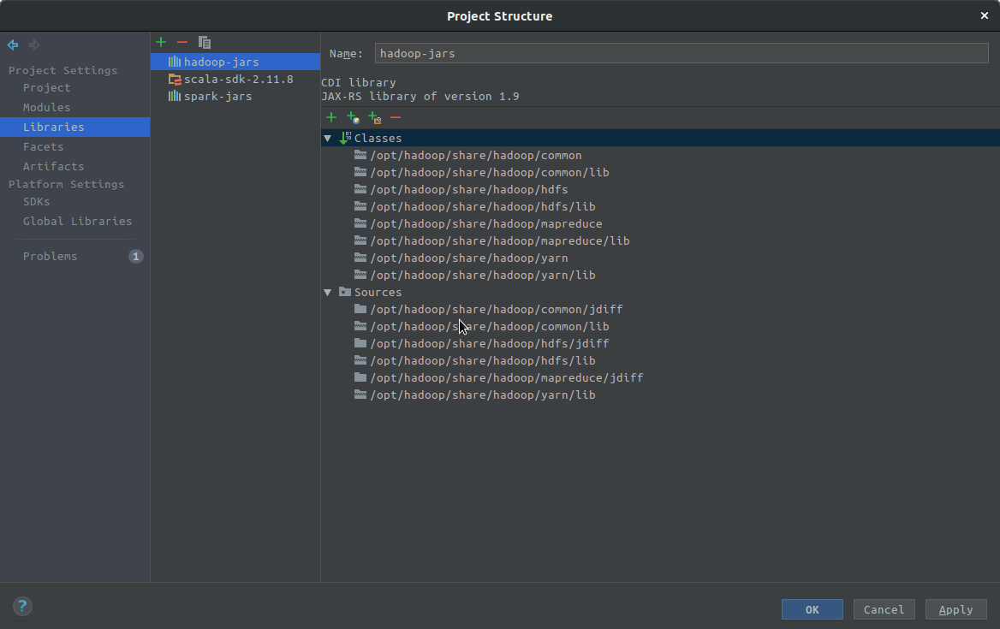
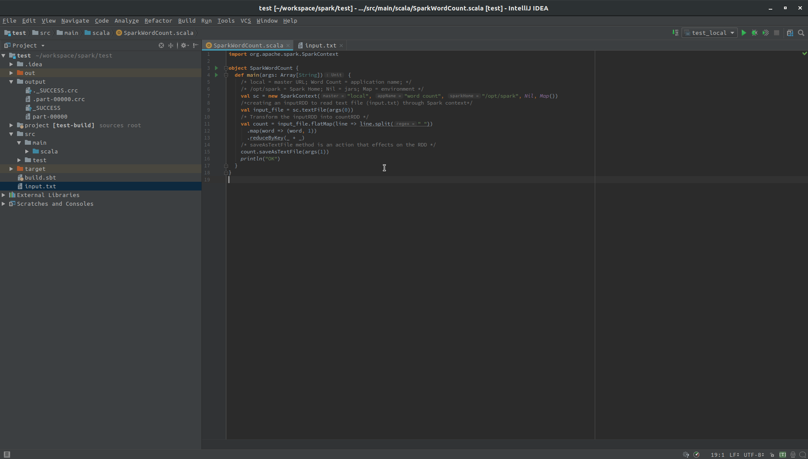
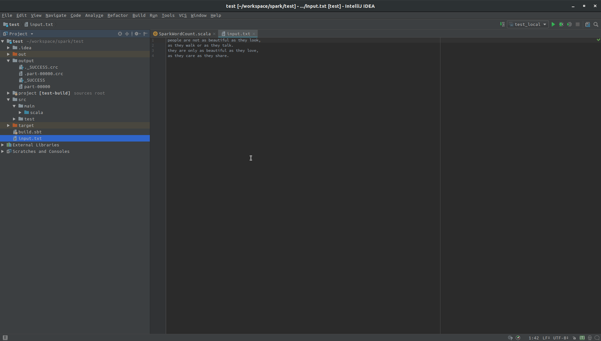
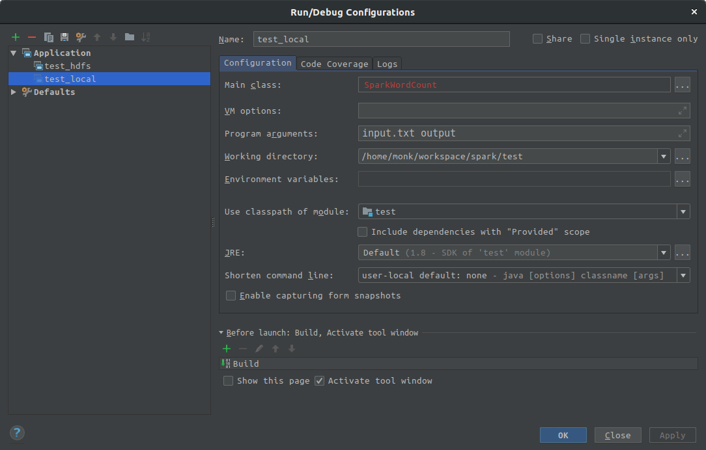
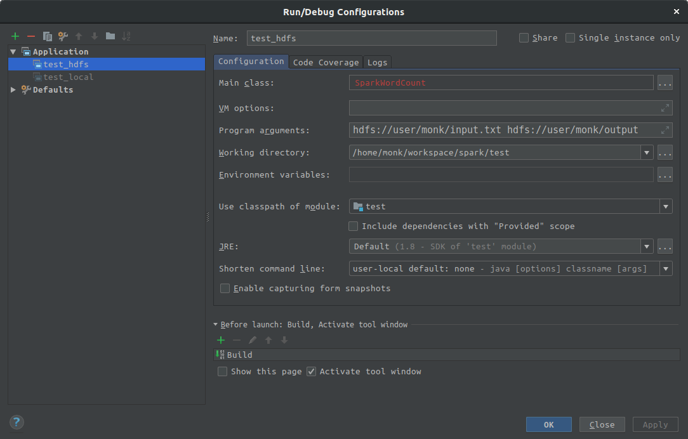

# spark

## 需要jdk(略)

## 需要hadoop，见[hadoop安装](hadoop.md)

## 需要scala，建议2.11版本

1. 可以使用apt源里的scala

```bash
sudo apt install scala
```

2. 可以去[官网](https://www.scala-lang.org/download/)下载最新版本的scala

解压并拷贝到/usr/share/目录下

```bash
sudo cp -r scala-2.12.4 /usr/share/
```

使用update-alternatives安装并配置scala，

```bash
sudo update-alternatives --install /usr/bin/scala scala /usr/share/scala-2.12.4/bin/scala 100
sudo update-alternatives --config scala
# 如果有多个版本的scala，进行选择配置
```

## 安装spark

去[官网](https://spark.apache.org/downloads.html)下载并解压spark到/opt目录(个人喜好，自行安装的软件放在了/opt目录)，对spark-\*.\*.\*-bin\*文件夹建立软链接到/opt/spark，便于日后更新版本

环境变量
```bash
export PATH="/opt/spark/bin:$PATH"
```

## 测试（终端）
启动hadoop，打开spark-shell
```
start-dfs.sh
```
建立测试用的文件input.txt
> people are not as beautiful as they look, 
> as they walk or as they talk.
> they are only as beautiful  as they love, 
> as they care as they share.


```bash
spark-shell
# 以下为spark-shell中操作
scala> val inputfile = sc.textFile("input.txt")
scala> val counts = inputfile.flatMap(line => line.split(" ")).map(word => (word, 1)).reduceByKey(_+_);
scala> counts.saveAsTextFile("output")
# 打开output文件夹查看输出
cat output/part-*
```




## 测试（程序）

编写scala程序：SparkWordCount.scala
```scala
import org.apache.spark.SparkContext

object SparkWordCount {
  def main(args: Array[String]) {
    /* local = master URL; Word Count = application name; */
    /* /opt/spark = Spark Home; Nil = jars; Map = environment */
    val sc = new SparkContext("local", "word count", "/opt/spark", Nil, Map())
    /*creating an inputRDD to read text file (input.txt) through Spark context*/
    val input_file = sc.textFile("input.txt")
    /* Transform the inputRDD into countRDD */
    val count = input_file.flatMap(line => line.split(" "))
      .map(word => (word, 1))
      .reduceByKey(_ + _)
    /* saveAsTextFile method is an action that effects on the RDD */
    count.saveAsTextFile("output")
    println("OK")
  }
}
```

编译、打包、测试、查看结果
```bash
scalac -classpath "/opt/spark/jars/*" SparkWordCount.scala
jar -cvf SparkWordCount.jar SparkWordCount*.class
spark-submit --class SparkWordCount --master local SparkWordCount.jar
cat output/part-00000
```

## 使用Intellij测试

1. 新建Scala SBT工程



2. 设置工程名称SparkWordCount，选择JDK版本、SBT版本、Scala版本=2.11


3. 在Project Structure -> Project Settings -> Libraries ，移除SBT；添加Scala SDK，版本选择2.11；添加java，路径为/opt/spark/jars









4. 在src/main/scala下新建Scala class，kind选择Object，完成代码SparkWordCount.scala；在工程目录下建立文件input.txt





5. 编译并运行，查看结果


